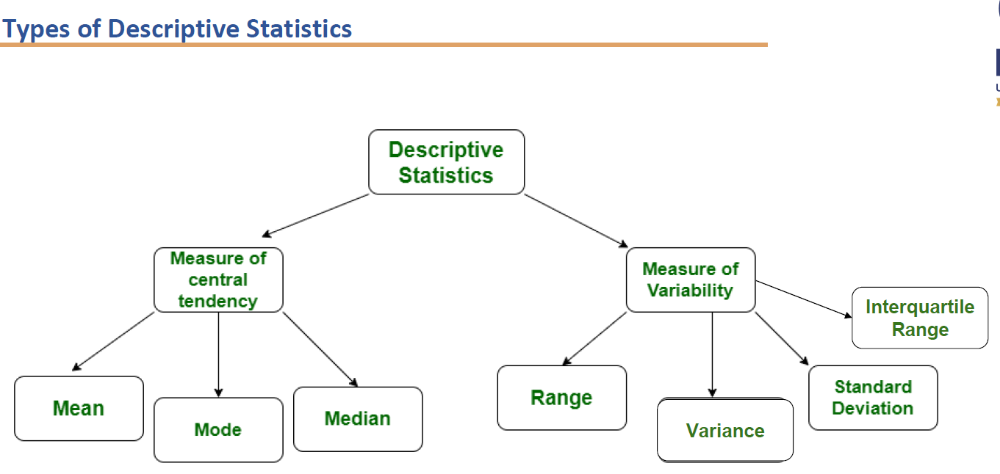
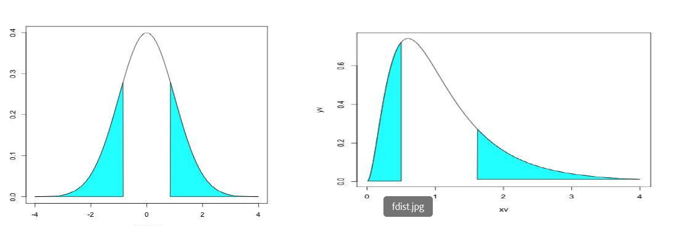

# Intro
	- Explain different areas of script statistics, The different measures of central tendency and the different measures of variability? #card
		- 
- # Central Tendencies - Mean
	- Explain the different methods of average and determining the centre of the data? #card
		- Mean median and mode. These are useless statisticians as a way of summarising where the centre of the data is.
		- $$mean = \frac{\Sigma x}{N}$$
		- The population mean is $\mu$ and sample mean is $\bar{x}$
		- median is the middle value when the data is arranged in order. If N is odd then it is the average of the middle two values
		- Mode  is the most common value
	- Explain the concept of weighted mean and how to calculate it? #card
		- Weighted mean is the average value when certain values of the data set contribute more to the mean value. Next slide
		- For a finite set of data with measurement values of X1, X2 ... X_{n} and the corresponding weights w1,w2 ..w_{n}. It is defined by the formula
		- $$\bar{x} = \frac{\Sigma^n_{i=1}w_{i}x_{i}}{\Sigma^n_{i=1}w_{i}}$$
		- Weighted average is one of the heavily used means calculating average in data science and machine learning. In this the X provides the different values of Inputs and the weights are the importance given to each other inputs.
	- What is trimmed mean and how to compute it? #card
		- Trimmed mean is completed by arranging the sample values in order, trimming an equal number of values from each end, and computing the mean of those remaining values. Exline
		- If P percentage of data stream from each end, The resulting trim the mean is called P% trimmed mean. There are no hard and fast rules on how many values to trim. The most commonly used remains are 5% 10 and 20.
		- This generally done to remove the outliers which could contribute heavily to the calculation of the average. The outliers tend to distort the average values and very large or very small single outlier value could potentially move the average very far away from the main central tendency.
		- 
		- If the sample  size is denoted by n, and a % trimmed mean is desired, then the number of datapoints to be trimmed is np/100
	- What are the advantages and disadvantages of mean? #card
		- Advantages:
			- It takes into account all the available information.
			- It can be combined with means of other groups to give the overall mean.
			- Easy and quick way to represent the entire data values by a single or unique number due to its straightforward method of calculation.
			- Each dataset has a unique mean value.
		- Disadvantages
			- It is a very sensitive measure.
			- Thus, its value is easily affected by extreme values known as outliers.
			- It can only be used on interval or ratio data.
- # Central Tendencies - Median
	- What is median? #card
		- Median: The value separating the higher half from the lower half of a data sample, population, or probability distribution.
		- It is the middle number in an sorted, ascending or descending list of numbers and can be more descriptive of that dataset than the average.
		- For a dataset, it may be thought of as "the middle" value.
		- The basic feature of the median, describing data compared to the mean (often simply described as "average"), is that it is not affected by a small proportion of extremely large or small values, and therefore provides a better representation of a "typical" value.
	- How to calculate the median? #card
		- Process of calculating median:
			- Arrange all the values of the dataset in ascending order.
			  
			  X1, X2, X3, ..., Xn
			- Find the middle position.
			- The element corresponding to the middle position is considered as the median if there are an odd number of elements present.
			  
			  i.e., if n is odd, median = (n+1)/2 * the element's value
			- If there are even numbers of elements present, then the average of the element(s) present in the middle position(s) is considered as the median.
			  
			  i.e., if n is even, median = ((n/2) * the element's value + (n/2+1) * the element's value) / 2
	- What Advantages and disadvantages of median? #card
		- Advantages:
			- Not affected by the outliers in the data set.
			- An outlier is a data point that is radically “distant” or “away” from common trends ofvaluesin a given set.
			- It does not represent a typical number in the set.
			- The concept of the median is intuitive and thus can easily be explained as the center value.
			- Each set has a unique median value.
		- Disadvantages:
			- Its value is perceived as it is.
			- It cannot be utilized for further algebraic treatment.
- # Mode
	- What is mode ? #card
		- The mode is the value that appears most often in a set of data values.
		- Like the statistical mean and median, the mode is a way of expressing a single number.
		- To calculate the mode, we need to look at which value appears most often.
		- Example: The mode of the sample [1,3,6,6,6,6,7,7,12,12,17] is 6.
		- Given the list of data [1,1,2,4,4], its mode is not unique. It has two modes: 1 and 4.
		- A dataset, in such a case, is said to be bimodal, while a set with more than two modes may be described as multimodal.
		- Empirical formula:
		- mean - mode = 3 x (mean - median)
	- What the advantages and disadvantages of mode? #card
		- Advantages:
			- Quick and easy to compute.
			- Unaffected by extreme values.
			- Can be used at any level of measurement.
			- Useful to find the most "popular" or common item. This includes datasets that do not involve numbers.
		- Disadvantages: It is a terminal statistic.
			- A given subgroup could make this measure unrepresentative of the population's centre.
			- If the set contains no repeating values, then the mode is irrelevant.
			- In contrast, if there are many values that have the same count, then the mode can be meaningless.
			-