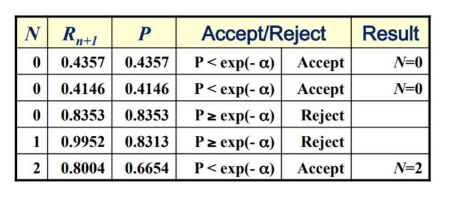

# Random Number generators
	- What is a random number and characteristics of generating such a number? #card
		- It is a random sequence of numbers obtained from a stochastic process.
		- A random number is a number chosen as if by chance from some specified distribution such that selection of a large set of these numbers reproduces the underlying distribution.
		- A random number is chosen using methods which give equal probability to all numbers occurring in the specified distribution.
		- In real world, random numbers may be generated using a dice or a roulette wheel.
	- What is a stochastic process? #card
		-
	- Explain some characteristics of random numbers? #card
		- Random numbers are most commonly produced with the help of a random number generators.
		- Random numbers have important applications, especially in cryptography where they act as ingredients in encryption keys.
		- One of the most important prerequisites of a random number is to be independent, as this helps in establishing no correlations between successive numbers.
		- It must be ensured that the frequency of the occurrence of these random numbers should be approximately be the same. As a result, theoretically, it is not easy to generate a long random number.
	- How are random numbers generated? #card
		- Random numbers are also very important for a simulations.
		- All the randomness required by a simulation model is obtained by a random number generator.
		- The output of a random number generator is assumed to be a sequence of independent and identically (uniformly) distributed random numbers between 0 and 1.
		- These random numbers are transformed into required probability distributions.
		- Example: The most common set from which random numbers are derived is the set of single-digit decimal numbers {0, 1, 2, 3, 4, 5, 6, 7, 8, 9}.
- # Random Number generators
	- What is a random number generator? #card
		- A random number generator is a hardware device or software algorithm that generates a number that is taken from a limited or unlimited distribution and outputs it.
		- The two main types of random number generators are pseudorandom number generators and true random number generators.
		- The numbers or sequence of numbers generated must lack any pattern (i.e. must appear random).
	- What is a true random number generator? #card
		- It measures some physical phenomenon that is expected to be random and then compensates for possible biases in the measurement process.
		- Example sources include measuring atmospheric noise, thermal noise, and other external electromagnetic and quantum phenomena.
	- What is a pseudo random number generator? #card
		- It uses computational algorithms that can produce long sequences of apparently random results.
		- But these results are in fact completely determined by a shorter initial value, known as a seed value or key.
		- As a result, the entire seemingly random sequence can be reproduced if the seed value is known.
		- Properties that pseudo-random number generators should possess:
		- It should be fast and not memory intensive
		- It must be able to reproduce a given stream of random numbers.
		- provision for producing several different independent streams of random numbers
		- The random numbers generated must meet some statistical tests for randomness intended to ensure that they do not have any easily discernible patterns.
	- What random number seed? #card
		- A random seed (or seed state, or just seed) is a number (or vector) used to initialize a pseudorandom number generator.
		- Computer-based generators use random number seeds for setting the starting point of the random number sequence.
		- For a seed to be used in a pseudorandom number generator, it does not need to be random.
		- These seeds are often initialized using a computer's real time clock in order to have some external noise.
	- What is a random variate? #card
		- A random variate is a variable generated from uniformly distributed pseudorandom numbers.
		- It is a particular outcome of a random variable.
		- The random variates which are other outcomes of the same random variable might have different values.
		- Random variates are used when simulating processes are driven by random influences (stochastic processes).
		- They are frequently used as the input to simulation models.
		- Procedures to generate random variates corresponding to a given distribution are known as procedures for random variate generation or pseudo-random number sampling.
		- Depending on how they are generated, a random variate can be uniformly or non-uniformly distributed.
		- Examples: Inter-arrival time and service time.
	- What are some of the needs, characteristics and objectives of random variate generation process? #card
		- Random variate generation is a fundamental aspect of simulation modeling and analysis.
		- The objective of random variate generation is to produce observations that have the stochastic properties of a given random variable.
		- Various methods and algorithms have been developed to generate random variates that are accurate (representative of the target distribution) and computationally efficient.
		- The distribution from which random variates are generated is assumed to be completely specified.
		- The objective of random variate generation is to produce sample observations that have the stochastic properties of a given random variable, X, having distribution function F(x) = Pr(X ≤ x), where −∞ < x < ∞
		- The development of the theory/concepts surrounding random variate generation via computer algorithms is based on the following two key assumptions:
		- Assumption 1: There exists a perfect uniform (0,1), U(0,1), random number generator that can produce a sequence of independent random variables uniformly distributed on (0,1).
		- Assumption 2: Computers can store and manipulate real numbers.
		- Although Assumptions 1 and 2 are used for developing Random Variate Generation theory, the assumptions are violated when implementing Random Variate Generation algorithms on digital computers.
	- What are some of the factors to be considered for random variate generation? #card
		- Exactness: Exactness or accuracy refers to how well the generator produces random variates with the characteristics of the desired distribution.
		  This refers to the theoretical exactness of the random variate generator itself, as well as the error that is induced by the U(0,1) random number generator and the error induced by digital computer calculations.
		- Speed: Speed refers to the computational set-up and execution time required to generate random variates. Contributions to time are:
			- Setup time
			- Variable generation time
		- Space: Space refers to computer memory that is required for the generator. Although space is not typically a major consideration for modern computers, computer memory was an important consideration in the early days of Random Variate Generation development.
		- Simplicity: Simplicity refers to the both the simplicity of the algorithm as well as the simplicity of implementation. This includes the number of lines of code, support routines required, number of mathematical operations, as well as portability across platforms and interaction with other simulation methods such as variance reduction techniques.
		- The importance of each of these factors will vary depending on the particular situation or simulation application.
	- What are different random variate generation techniques? #card
		- We assume that a pseudorandom number generator RN(0,1) producing a sequence of independent values between 0 and 1 is available.
		- General methods:
		- Inverse transform method
		- Acceptance-rejection method
		- Composite method
		- Translations and other simple transforms
	-
- # problems
	- Problem1: Generate sample of a random variable X with a given density f. (The sample is called a random variate) #card
		- Answer: Develop an algorithm such that if one used it repeatedly (and independently) to generate a sequence of samples X1, X2, ..., Xn then as n becomes large, the proportion of samples that fall in any interval [a, b] is close to P(X ∈ [a, b]), i.e P{Xi ∈[a, b]}/n ≈ P(X ∈[a, b])
		- **The Problem:** We want to generate random samples (called "random variates") from a specific probability distribution with a given probability density function f(x). For example, if we have a normal distribution, exponential distribution, or any other distribution, we want our computer to produce random numbers that follow that exact distribution pattern.
		- **The Solution:** The solution is to create an algorithm (a step-by-step computer procedure) that can generate these random samples. The key requirement is that this algorithm must work correctly when used repeatedly.
		- **How we know it works:** If we use this algorithm many times to generate a large sequence of samples X₁, X₂, X₃, ..., Xₙ, then as n gets very large, the samples should behave exactly like the original distribution.
		- Specifically, if we look at any interval [a, b] and count how many of our generated samples fall within that interval, the proportion should be very close to the true probability P(X ∈ [a, b]) that the original distribution assigns to that interval.
		- **Simple Example:** If we want to simulate a fair coin (50% heads, 50% tails), our algorithm should produce roughly 50% heads and 50% tails when we flip it many times. If we want samples between 3 and 7 from a normal distribution, and the true probability is 0.3, then about 30% of our generated samples should fall in that range.
		  This is the foundation of Monte Carlo simulation - using computers to generate random samples that mimic real-world probability distributions.
	- Problem2 : Give me the question? #card
		- Solution: 2-step process
		- Generate a random variate uniformly distributed in [0,1], also called a random number.
		- Use an appropriate transformation to convert the random number to a random variate of the correct distribution.
		- Why is this approach good?
		- Answer: It focuses on generating samples from ONE distribution only.
	- problem3: Explain the process of generating random variate for Poisson distribution using the Acceptance and Rejection method #card
		- 
		- 
		- It took five random numbers to generate three Poisson variates
		- In long run, the generation of Poisson variates requires some overhead!
		- 
		-