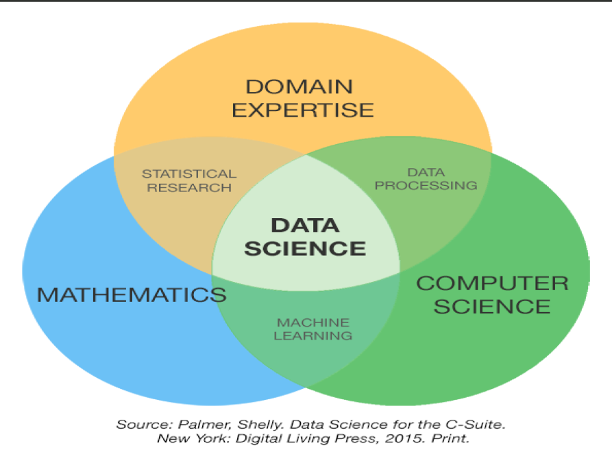
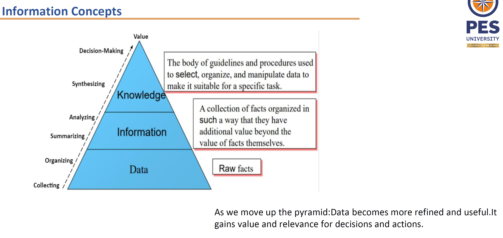
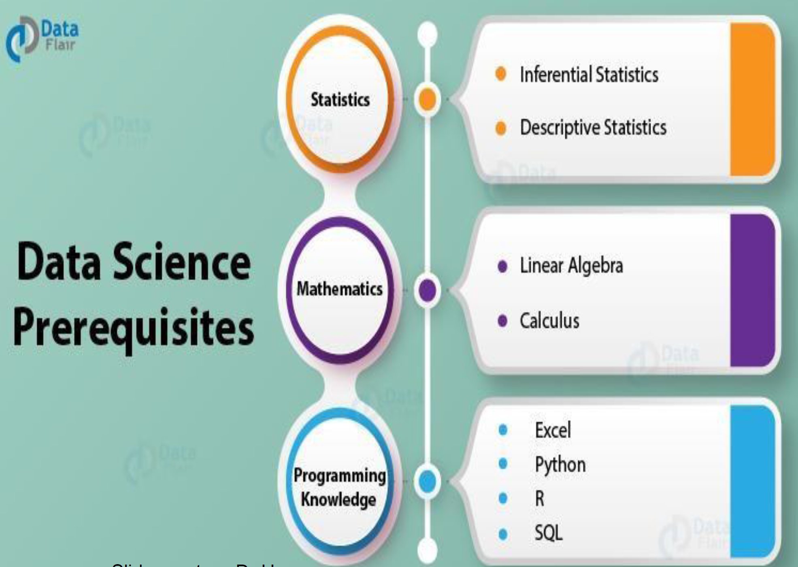
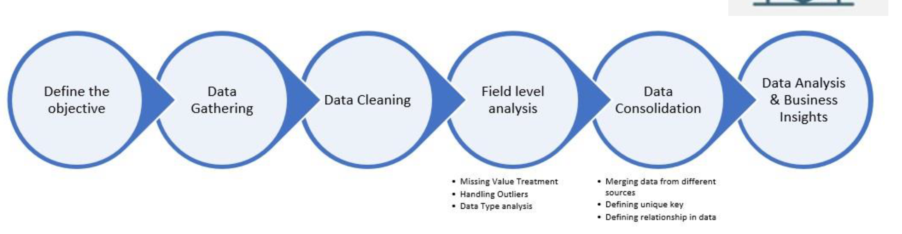
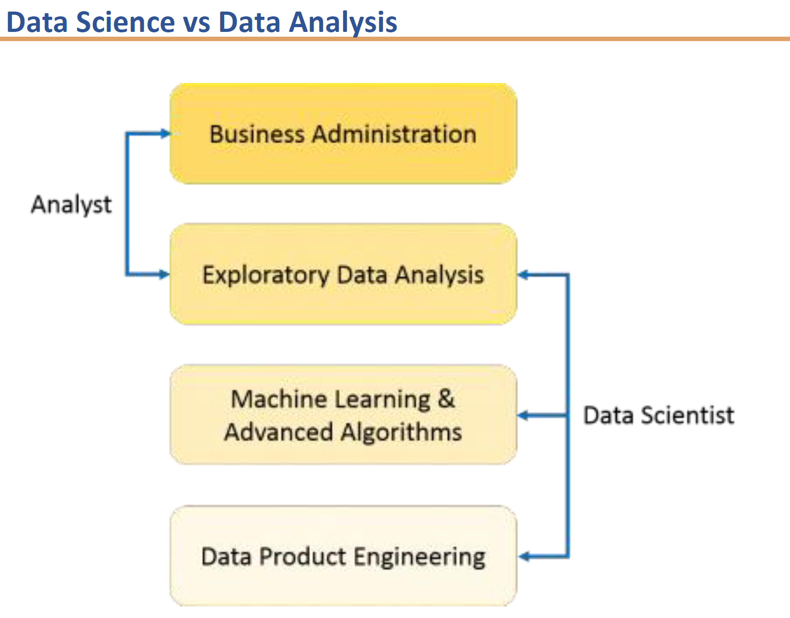

- What is data science? #card
  card-last-interval:: 4
  card-repeats:: 1
  card-ease-factor:: 2.6
  card-next-schedule:: 2025-08-21T14:57:59.567Z
  card-last-reviewed:: 2025-08-17T14:57:59.567Z
  card-last-score:: 5
	- It is the discipline of extracting meaningfule insights and solutions from data
	- Helps solve many real-world problems leveraging data
	- It combines techniques from stats , CS , Math and domain to make informed decision and solve problems
	- 
- Name some general applications of Data Science? #card
  card-last-interval:: 4
  card-repeats:: 1
  card-ease-factor:: 2.36
  card-next-schedule:: 2025-08-21T15:09:30.090Z
  card-last-reviewed:: 2025-08-17T15:09:30.090Z
  card-last-score:: 3
	- Recommendation Systems , Fraud detection and predictive analytics
	-
- Name some application of Data Science in different domains. #card
  card-last-interval:: -1
  card-repeats:: 1
  card-ease-factor:: 2.5
  card-next-schedule:: 2025-08-17T18:30:00.000Z
  card-last-reviewed:: 2025-08-17T15:05:51.747Z
  card-last-score:: 1
	- Marketing - Cross selling , upselling, predicting value of a customer, churn
	- Credit and insurance claims prediction and fraud and risk detection
	- Healthcare disease prediction and medication effectiveness next
	- Automation self driving cars pilotless aircrafts and drones
	- Airline industry route planning revenue management prediction on in flight sales and food supplies
	- Recommendation systems are used to make product and movie recommendations on different online platforms
	- Data science is used in weather forecasting for both short term and long term prediction
	- Data science used in health industry to make genome matching monitoring patient health providing virtual assistance and and medical imaging analysis
- What is data ? #card
  card-last-interval:: 4
  card-repeats:: 1
  card-ease-factor:: 2.6
  card-next-schedule:: 2025-08-21T15:06:53.190Z
  card-last-reviewed:: 2025-08-17T15:06:53.190Z
  card-last-score:: 5
	- Data refers to individual facts statistics or items of information often numeric that are collected through observation. It also includes graphs and other kinds of structured and unstructured data elements.
- Differentiate between Data and Information #card
  card-last-interval:: 4
  card-repeats:: 1
  card-ease-factor:: 2.6
  card-next-schedule:: 2025-08-21T15:06:46.121Z
  card-last-reviewed:: 2025-08-17T15:06:46.121Z
  card-last-score:: 5
	- Data refers to raw facts usually formatted in a special way. It is based on records and observations and is usually unorganised.
	- Information is a collection of facts organised in such a way that they have additional value beyond the value of the facts themselves. It is based on anxious data and is usually analysed and organised.
- Explain the types of data? #card
  card-last-interval:: -1
  card-repeats:: 1
  card-ease-factor:: 2.5
  card-next-schedule:: 2025-08-17T18:30:00.000Z
  card-last-reviewed:: 2025-08-17T15:10:34.766Z
  card-last-score:: 1
	- Alphanumeric which consists of numbers letters and other characters
	- Image data which consists of graphic images or pictures
	- Audio data and video data
- Explain structured, unstructured and semi structured data #card
  card-last-interval:: -1
  card-repeats:: 1
  card-ease-factor:: 2.5
  card-next-schedule:: 2025-08-17T18:30:00.000Z
  card-last-reviewed:: 2025-08-17T15:11:48.705Z
  card-last-score:: 1
	- Structured data status data whose elements are organised in a tabular structure typically and is addressable for effective analysis. The data is typically stored in a relational database as the relational database offers the basic tableau structure and associated components for analysis such as sql query and procedures and views.
	- Semi structured data is data in which it has some structure but is not directly organised into tablet structure. Examples of these are xml and Json data
	- Unstructured data is not organised in a predefined manner and does not conform to a predefined data model. A data model refers to a database consisting of a collection of tables with defined relationships between those tables. Examples of such unstructured data include textual data such as product reviews, conversation histories etc. Typically these are stored in text processing formats such as word pdf text files etc. Audio and video files are currently used for applications in machine learning and artificial intelligence under considered unstructured data.
- Explain the different steps involved in deriving value out of data? #card
  card-last-interval:: -1
  card-repeats:: 1
  card-ease-factor:: 2.5
  card-next-schedule:: 2025-08-17T18:30:00.000Z
  card-last-reviewed:: 2025-08-17T15:15:50.606Z
  card-last-score:: 1
	- The different steps are number one collecting data organising data and then summarising it for further analysis. After analysis step we get information based on the data at this step the collection of facts is organised in such a way that they have additional value beyond the value of facts themselves.
	- The next step consists of applying domain knowledge and a set of body of guidelines and procedures to select organised and manipulate data so that it can be used for decision making. The value is thus derived after the decision making step enabling the data to be used for generating business value.
	- 
- Why do we need data science? #card
	- The unstructured data is growing at a very high rate. Data science helps in analysing and drawing inferences from this type of data. Data science provides number of methods and techniques to do with different types of data and extract useful information and decision making for that.
- Explain the different steps of how to use data? #card
	- Explore and identify patterns
	- Make predictions which are informed guesses
	- draw inferences which is basically quantifying what you would like to know
- Explain the methodology of data science? #card
	- The first steps involves asking the right questions and setting the objective
	- The next step involves exploring the data using descriptive statistics
	- A mathematical model is then derived using a modelling techniques and data and using various different algorithms
	- Finally the inferences of the data is communicated using visualisation techniques such as charts bar graphs text etc
- Name the different type of skills that the data scientist is expected to have? #card
	- Mathematics and statistical skills include descriptive statistical analysis exploratory statistical analysis statistical modelling regression analysis clustering and machine learning algorithms
	- Ability programme induce data sources such as databases. Computer science fundamentals data visualisation tools such as tablu and power bi. Python programming and a good understanding of big data frameworks such as Apache Spark s Snowflake and other industry related tools.
	- Good communication is relation skills and ability to represent the data in different visualisation methodologies such as charts bar graphs histograms heat maps box charts etc
	- {:height 488, :width 676}
- What are the different steps that are done by data scientist? #card
	- Collect the raw data
	- Process the raw data. Typical processing of the raw data includes eliminating duplicates removing invalid values filling in missing values structuring the data if needed. After this step the raw data is converted into what is called as datasets which are basically in a format that can be used for statistical modelling analysis or machine learning algorithms for clustering or predictions.
	- From the statistical model analysis different visualisations or data driven products can be created. Similarly from machine learning predictions algorithms different visualisations reports and data driven products can be created.
	- 
- Explain the difference between Data analysis and Data Science #card
	- 
- What are the common tasks in Data Science? #card
	- Is this A or B ?  - Classification  algorithm
	- Is this different ? Anamoly detection algorithm
	- How much or how many ? Regression algorithm
	- How is this organized ? Clustering algorithm
	- What should i do next ? Reinforcement learning