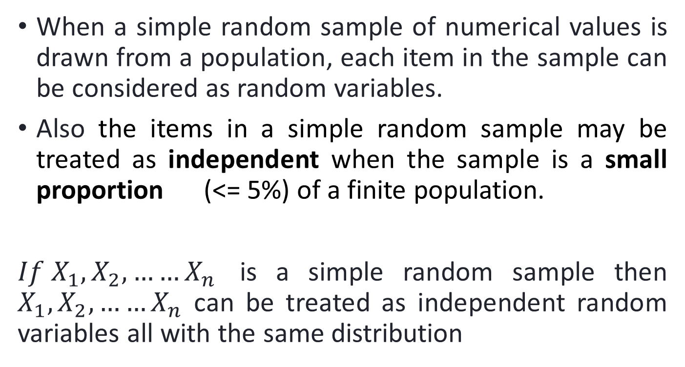
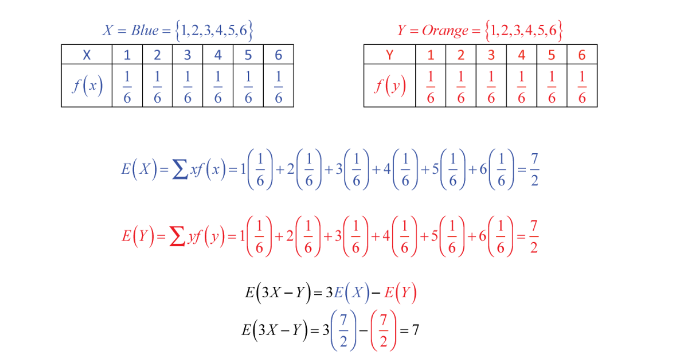

# Intro
	- Describe some operations one on the random variables? #card
		- We often construct new random variables by performing arithmetic operations on other random variables.
		- For example, we might
		- Add a constant to a random variable
		- Multiply a random variable by a constant
		- Add two or more random variables together. (Combine multiple random variables)
		- Addition – Adding a constant to each value of X.
		- Subtraction – Subtracting a constant from each value of X.
		- Multiplication – Multiplying each value of X by a constant.
		- Division – Dividing each value of X by a constant.
		- where, X represents a Random Variable
- # Addition
	- What happens when a constant is added to a random variable? #card
		- When a constant is added to a random variable
		- the mean is increased by the value of the constant
		- the variance and standard deviation remains unchanged
		- 
- # multiplication
	- What happens when constant multiplies a random variable? #card
		- Often we need to multiply a random variable by a constant
		- Multiplication by a constant affects the mean, variance, and standard deviation of a random variable:
		- Mean gets multiplied by the constant
		- 
		- Variance is multiplied by square of the constant
		- Standard Deviation gets multiplied by modulus value of the constant
		- 
		- 
		-
- # mult and add
	- What happens when a random variable is multiplied by a constant and added by another constant? #card
		- Multiplication and Addition by a constant affects the mean, variance, and standard deviation of a random variable (Say constant 'a' is multiplied and 'b' is added):
		- Mean gets multiplied by the constant 'a' and the product value is increased by constant 'b'
		- Variance is multiplied by square of the constant 'a'
		- Standard Deviation gets multiplied by modulus value of the constant 'a'
		- 
	- Describe using a table the effects on mean , variance and probability histogram the effect of different operations on the random variables? #card
		- 
		- 
- # combining random variables
	- What is a linear combination of random variables? #card
		- There are many instances where it might require us to examine more than a single random variable at once
		- We can form new distributions by combining random variables
		- 
		-
	- Describe how mean of a combination of random variables is computed? #card
		- Consider the below scenario where X and Y are two random variables and let T be a combination of both the random variables X and Y then
		- 
		- more generally
		- 
		- 
- # Independent Random variables
	- What are independent random variables? #card
		- Two random variables are independent if knowledge concerning one of them does not affect the probabilities of the other.
		- The notion of independence for random variables is very much like the notion of independence for events.
		- When two events are independent, the probability that both occur is found by multiplying the probabilities for each event i.e. P(X=a and Y=b) = P(X=a) * P(Y=b)
		- 
	- Describe the  effect on the variance of combining random independent variables? #card
		- 
		- when all the constants are equal to 1
		- 
	- Describe the effect on variance the process of combining two random variables? #card
		- 
		- 
	- State the  important points about combining random variables. #card
		- Make sure that the random variables are independent or that it's reasonable to assume independence, before combining variances.
		- Even when we subtract random variables, we still add their variances; subtracting two variables increases the overall variability in the outcomes.
		- We can find the standard deviation of the combined distributions by taking the square root of the combined variances.
-
- # independence and Simple random samples
	- What are independent and simple random samples? #card
		- 
		- 
		-
- # problems
	- problem1 : Marie has a part-time job walking dogs to earn money on weekends. The following probability distribution represents the probability of having a particular number of clients on any given day. If she earns $2.75 per client, how much could she expect to earn each day, on average, and what is the standard deviation of her expected earnings?
	  |client|20|25|30|35|40|
	  |--|--|--|--|--|--|
	  |probability|.15|.35|.30|.15|.05| 
	  #card
		- {:height 478, :width 887}
		-
	- problem2: Solve
	  
	  #card
		- 
	- problem 3: solve 
	  
	  #card
		- 
	- problem 4: solve
	  id:: 68bd987f-1383-4586-850e-c913730b1c0b
	  
	  #card
		- 
		- Means combine very easily with addition or subtraction.
		- We can't add standard deviations.
		- Variances can be added.
		- We can't add standard deviations. Square root of variance is the standard deviation.
		- Add variances even if subtracting the random variable.
		-
	- problem 5: solve
	  
	  #card
		- 
	- problem6: solve
	  
		- 
		-
	- problem7: Let X represent the number that occurs when a blue die is tossed and Y, the number that happens when an orange die is tossed. Calculate the expected value of the linear combination 3X – Y of the random variables X and Y. #card
		- 
		  id:: 68bd9aaf-b817-4641-b689-7e2a063a0e42
	- problem 8
	  
	  #card
		- 
	- problem 9: 
	  
	  #card
		- 
	- problem 10 SRS travels offers a half-day trip in a tourist area. There must be at least 2 passengers for the visit to run. The vehicle provided by SRS travels can hold up to 6 passengers. 
	  SRS travels charges Rs. 150 per passenger. The amount spent on petrol and permit by SRS travels per trip is Rs. 100. Number of passengers that turn up on a randomly selected day (X) and the corresponding probabilities are given below.
	  
	  #card
		- 
		- 
	- problem 11: The expectation of a linear function E[aX+b] is equal to 
	  A) aE(X)+b 
	  B) E(a)E(X)+b 
	  C) E(X+a+b) 
	  D) aE(X+b)a
	  
	  If X is a random variable and Y=3X+5 then Var(Y)= 
	  A) 3⋅Var(X) 
	  B) 9⋅Var(X) 
	  C) Var(X)+5 
	  D) 3+Var(X)+5
	  #card
		- do it yourself
		-
	- problem 11
	  
	  #card
		- do it yourself
	- problem 12: Define a new random variable T that represents number of passengers that SRS and VRL can expect on a randomly selected day. Find mean and variance of T. #card
		- do it yourself
		-
		-
		-