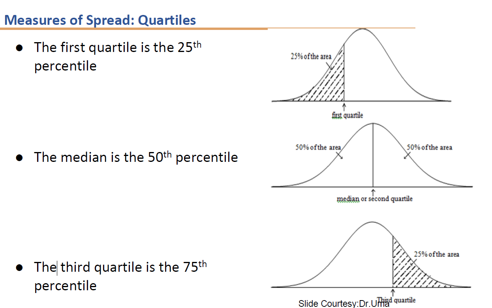
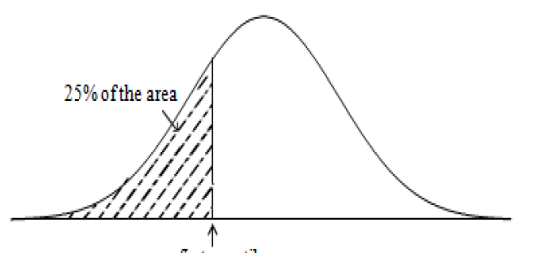
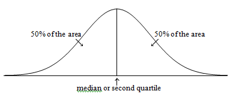
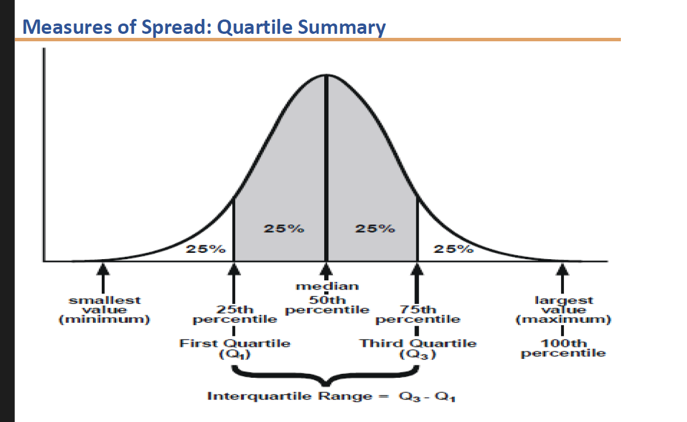
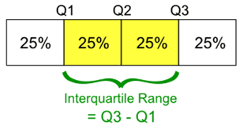
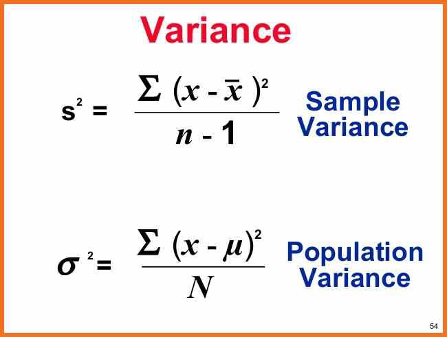
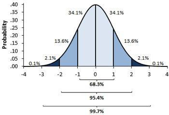
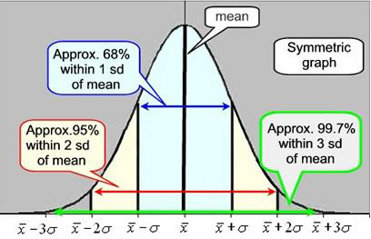

# Intro
	- What is measures of spread/dispersiion? #card
		- In statistics, the measures of dispersion help to interpret the variability of data.
		- It helps to know how much homogeneous or heterogeneous the data is.
		- In simple terms, it shows whether the variable is squeezed (too tightly grouped) or scattered (spread out).
	- What are the types of dispersion methods? #card
		- There are two main types of dispersion methods in statistics:
			- (i) Absolute Measure of Dispersion
			- (ii) Relative Measure of Dispersion
	- What is absolute measure of dispersion? #card
		- It contains the same unit as the original dataset.
		- The absolute dispersion method expresses variations in terms of the average of deviations of observations like standard deviation or mean deviation.
		- It includes measures such as range, standard deviation, quartile deviation, etc.
	- What is relative measure of dispersion? #card
		-
		- The relative measures of dispersion are used to compare the distribution of two or more datasets.
		- This measure compares values without units.
		  Common relative dispersion methods include:
			- Coefficient of Range
			- Coefficient of Variation
			- Coefficient of Standard Deviation
			- Coefficient of Quartile Deviation
			- Coefficient of Mean Deviation
- # Range
	- What is spread of dispersion - range ? #card
		- Range is the most common and easily understandable measure of dispersion.
		- It is the difference between two extreme observations of the dataset.
		- If Xmax and Xmin are the two extreme observations, then: Range = Xmax - Xmin
		- The range can sometimes be misleading when there are extremely high or low values.
		- Example: {8, 11, 5, 9, 7, 6, 3616}
		- Lowest value: 5 Highest value: 3616
		  Range = 3616 - 5 = 3611
		- The single value of 3616 makes the range large, but most values are around 10.
		- Downloading model
	- What are the advantages and disadvantages of range? #card
		- Advantages:
			- It is the simplest of the measures of dispersion.
			- Easy to calculate.
			- Easy to understand.
			- Independent of change of origin.
		- Disadvantages:
			- It is based on two extreme observations. Hence, gets affected by fluctuations.
			- A range is not a reliable measure of dispersion.
			- Dependent on change of scale.
			- It can and radically be affected by outliers (values that are not typical as compared to the rest of the elements in the set).
- # Quantiles
	- What is a quantile?
		- When presenting or analyzing measurements of a continuous variable, it's sometimes helpful to group subjects into several equal groups.
		- For example, to create four equal groups, we need values that split the data such that 25% of the observations are in each group.
		  The cutoff points are called quartiles, and there are three of them - the middle one is also known as the median.
		- Likewise, we use two tertiles to split the data into three groups, four quintiles to split them into five groups, and so on.
		- The general term for such cutoff points is quantiles.
		  
		  Other values likely to be encountered are:
		- Deciles: which split data into 10 parts
		- Centiles (or percentiles): which split the data into 100 parts, also known as percentiles
		  
		  Values such as quartiles can also be expressed as centiles; for example, the lowest quartile is also the 25th centile and the median is the 50th centile.
	- What is a quintile? Give examples? #card
		- A quintile is a statistical value of a dataset that represents 20% of a given population, so the first quintile represents the lowest fifth of the data (1% to 20%), the second quintile represents the second fifth (21% to 40%), and so on.
		- Example: ● Quintiles are used to create cut-off points for a given population.
		- ● A government-sponsored socio-economic study may use quintiles to determine the maximum wealth that a family could possess in order to belong to the lowest quintile of society.
		- ● This cut-off point can then be used as a prerequisite for a family to receive a special government subsidy aimed at helping society's less fortunate.
		- Downloading model
- # Percentile
	- What is a percentile? Give examples ? #card
		- A percentile is a comparison measure between a particular value and the values of the rest of the dataset.
		- It shows the percentage of values that a particular element has surpassed.
		- Example:
		- If your score = 75 and your percentile rank = 85th, then: • Interpretation: You performed better than 85% of the people who took the same test. • Percentile tells you your position relative to others, not the raw score itself. • The higher the percentile, the better your performance compared to the group.
		- In other words, a high percentile rank indicates that you scored above a certain percentage of the population, while a low percentile rank indicates that you scored below that percentage.
	- How to calculate the percentile? #card
		- The percentilerank is calculated using the formula:
		- R = (P/100) * (N + 1)
		- where P is the desired percentile and N is the number of data points.
		- The pth percentile of a sample, for a number pb between 0 and 100, divides the samples such that:
		  p% of the sample values are less than the pth percentile. ○ (100 - p%) are greater than the pth percentile.
		- **Steps to calculate the percentile rank:**
		- 1 Order the n sample values from smallest to largest
		- 2 Compute the quantity (P/100)(n+1), where n is the sample size
		- 3 If the above quantity is an integer, the sample value in this position is the percentile
		- 4 Otherwise, average the two sample values at the preceding and succeeding integer positions with respect to the quantity obtained in step 3
- # Quartile
	- What are quartiles? #card
		- Quartiles are the values that divide a list of numbers into quarters.**
		- Quartiles are obtained by first putting the list of numbers in order and then cutting the list into four equal parts
		- The Quartiles are at the "cuts" in the data
		- The first quartile, (Q1) is the middle number between the smallest number and the median of the data
		- The second quartile, (Q2) is the median of the data set
		- The third quartile, (Q3) is the middle number between the median and the largest number
		- 
	- How to calculate the first quartile? #card
		- **The First Quartile:**
		- • The first quartile is the point which gives us 25% of the area to the left of it and 75% to the right of it
		- • This means that 25% of the observations are less than or equal to the first quartile and 75% of the observations greater than or equal to the first quartile
		- • The first quartile is also called the 25th percentile
		- 
		- To find the first quartile, compute the value 0.25(n+1).
		- If this is an integer, then the sample value in that position is the first quartile.
		- If not, then take the average of the sample values on either side of this value.
	- How to compute the 2nd quartile? #card
		- The Second Quartile or median:
		- It is easy to see how to divide the area in Figure into two equal parts, since the graph is symmetric.
		- The point which gives us 50% of the area to the left of it and 50% to the right of it is called the second quartile or median.
		- Second quartile is calculated using the value 0.5(n+1).
		- 
		-
	- How to compute the 3rd quartile? #card
		- **The third quartile is the point which gives us 75% of the area to the left of it and 25% of the area to the right of it.**
		- This means that 75% of the observations are less than or equal to the third quartile and 25% of the observations are greater than or equal to the third quartile.
		- The third quartile is also called the 75th percentile.
		- The third quartile is computed in the same way, except that the value 0.75(n+1) is used.
	- Depict the different quartiles on a distribution? What is the interquartile range? #card
		- 
- # Interquartile range
	- What is inter quartile range? #card
		- **Interquartile range is the distance or range between the 25th percentile and the 75th percentile.**
		- That is, it quantifies the difference between the third and first quartiles.
		- Interquartile Range = Upper Quartile (Q3) – Lower Quartile (Q1)
		- IQR = Q3 – Q1
		- 
	- What are the steps to find the IQR? #card
		- **Arrange the data scores in ascending order.**
		- **Find the median of the data set (the number in the middle).**
		- **Find the median of the lower half of the scores (Q1).**
		- **Find the median of the upper half of the scores (Q3).**
		- **Note: If the number of scores is even, the median is the average of the two middle scores.**
- # variance
	- what is variance? #card
		- Variance is a measure of the spread of the recorded values on a variable.
		- It is a measure of dispersion, meaning it is a measure of how far a set of numbers is spread out from their average value.
		- The larger the variance, the further the individual cases are from the mean and vice verse
		- It is the average of the distance that each score is from the mean (squared deviation from the mean).
	- How to calculate the variance? #card
		- Find the mean value of the given data values.
		- Subtract mean from each data value.
		- Square each value that is obtained from step 2.
		- Find the sum of all values that is obtained from step 3.
		- Divide the result that is obtained from step 4 by N (for population) and n-1 (for sample).
		- 
- # Standard deviation
	- what is standard deviation? #card
		- Standard deviation signifies the deviation of the elements of the data set from the mean value of the distribution.
		- It quantifies the amount of variation of a set of data values.
		- It is a measure of the variability of a single item.
		- The standard deviation does not decline as the sample size increases.
		- The estimate of the standard deviation becomes more stable as the sample size increases.
		- 
		- 
		- Larger the standard deviation, greater amounts of variation around the mean.
		- Standard deviation = 0 only when all values are the same (only when you have a constant and not a "variable").
		- If you were to "rescale" a variable, the standard deviation would change by the same magnitude.
		- Like the mean, the standard deviation will be inflated by an outlier case value.
	-