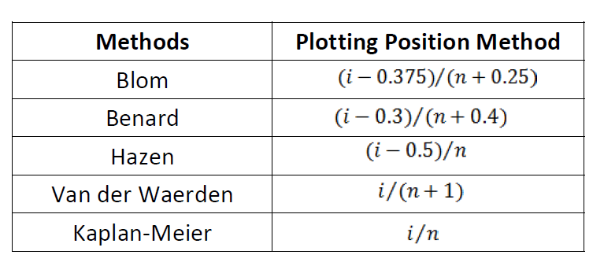
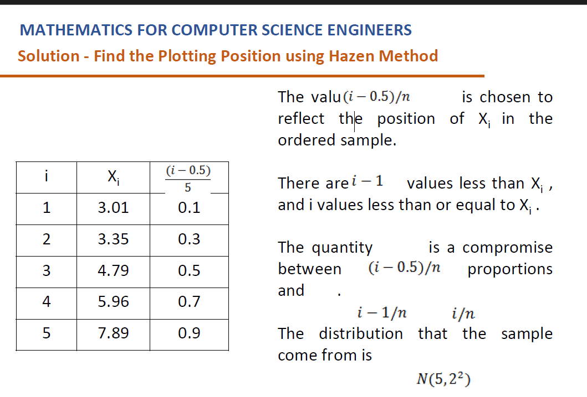
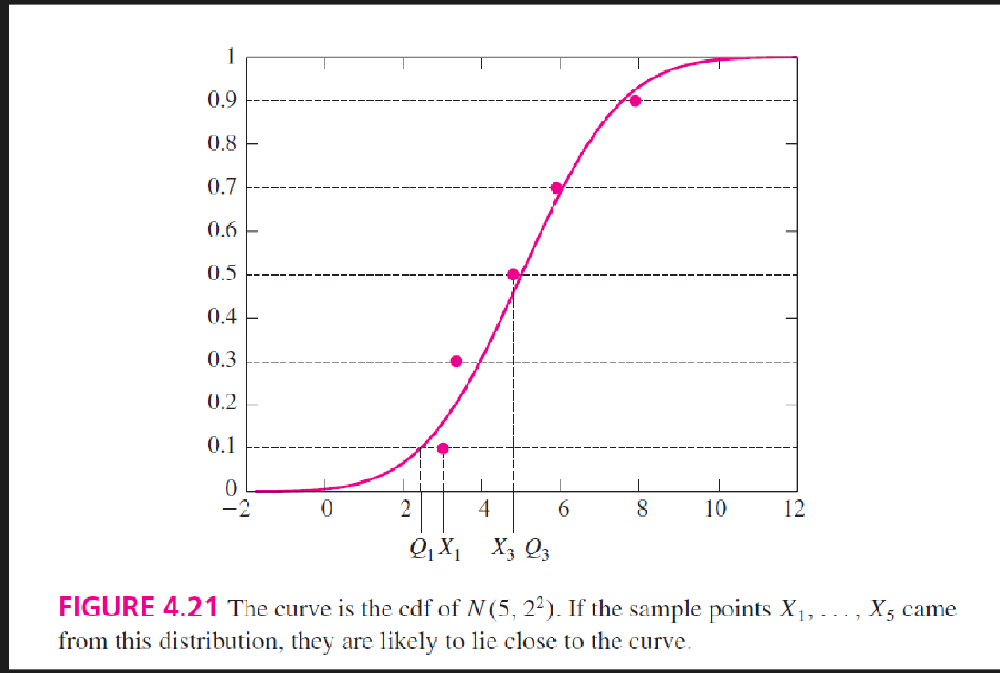
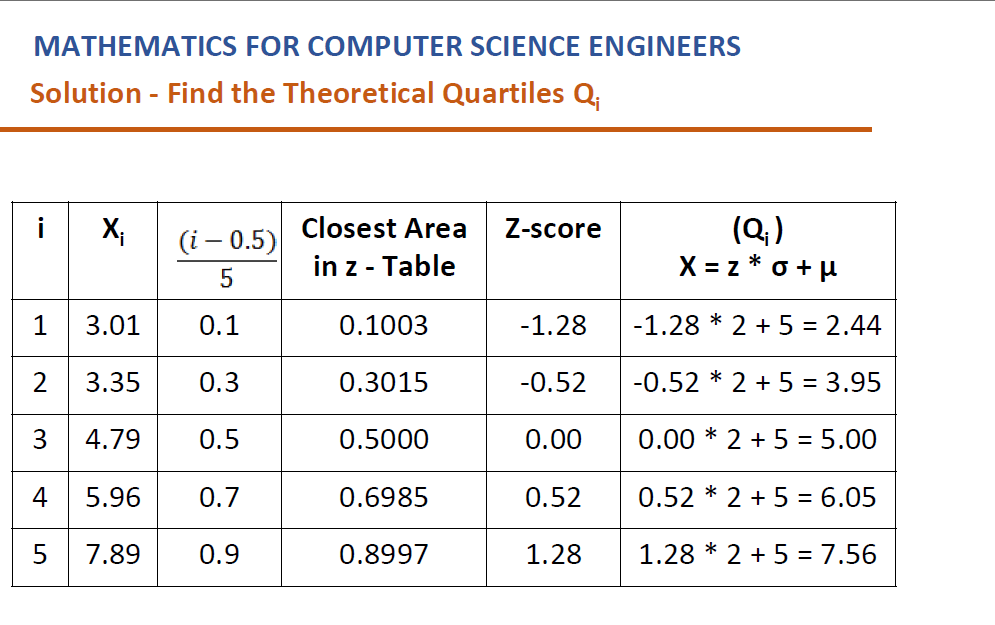
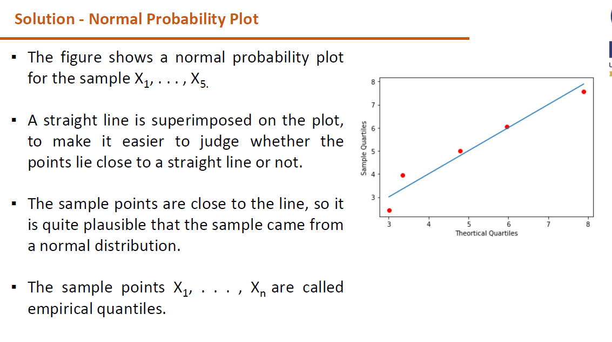

# Intro
	- What is a probability plot? #card
		- Not all continuous random variables are normally distributed!
		- It is important to evaluate how well the data are approximated by a normal distribution.
		- So far, we have always worked with randomly selected samples from some population.
		- We have used an appropriate probability distribution to fit into the data accordingly.
		- The probability plot is one way of accessing it through graphical representation.
		- By visualizing the data, we can achieve tremendous amount of information
		- The data that is being plotted in the theoretical normal distribution should form a straight line. This denotes the normality of the data.
		- A straight diagonal line depicts that the data is normally distributed.
		- Identifies whether the data is skewed to left or right which does not fit the normal distribution.
		- For larger samples,
		- Histogram will have a bell shaped curve which we call as symmetric and there will not be any outliers.
		- The mean, median and mode will be similar and lie at the same point.
		- In the similar way, 68% of observations lies within one standard deviation of the mean. 95% within two and 99.7% with three standard deviations.
		- For small samples,
		- Histogram does not provide good visual presence, hence to conform its normality we can use Probability Plots.
- # probability plots construction
	- What are the different ways of dividing data equally between 0 and 1 ? #card
		- 
	- How to construct a probability plot? #card
		- Sort the data.
		- Assign evenly spaced values to the data between 0 and 1.
		- For each xi in the data set,
		- Where, i is the position of the data item n is the size of the data set.
		  Find theoretical quantiles - Qi.
		- Plot every point (xi, Qi).
		- Plot (xi, xi)
		- Look into the observation whether it forms approximately straight line. This helps us to understand the type of distribution.
	- problem1: Construct a normal probability plot for the following data. Do these data appear to come from an approximately normal distribution? 3.01, 3.35, 4.79, 5.96, 7.8 #card
		- Sort the values 3.01, 3.35, 4.79, 5.96, 7.89 / n = 5
		- 
		- 
		- From the plot we can infer that (X1, 0.1) intersects at the point (Q1, 0.1). We understand that Q1 is at the 10th percentile of the N(5, 2²) distribution.
		- Applying similar reasoning to the remaining points, we would expect each Qi to be close to its corresponding Xi by 20th, 30th, 40th and so on.
		- The probability plot consists of the points (Xi, Qi).
		- Since the distribution that generated the Qi was a normal distribution, this is called a normal probability plot.
- # Understanding behind the normal probability plot
	- If X1, ..., Xn do in fact come from the distribution that generated the Qi, the points should lie close to a straight line.
	- To construct the plot, we must compute the Qi.
	- These are the 100(i − 0.5)/n percentiles of the distribution that is suspected of generating the sample.
	- In this example the Qi are the 10th, 30th, 50th, 70th, and 90th percentiles of the N(5, 2²) distribution.
	- We could approximate these values by looking up the z-scores corresponding to these percentiles, and then converting to raw scores.
	- 
	- 
- # Q-Q plot
	- What are Q-Q plots? #card
		- The points Q1, ..., Qn are called quantiles (divides distribution into equal sized areas) of the distribution.
		- These are the points in the data below which a certain proportion of the data falls.
		- The probability plot is sometimes called a quantile–quantile plot, or QQ plot.
		- We can use this Q-Q plot to check the assumption of Normality of the data.
		- Determines whether if two set of quantiles come from the populations of same distribution. If, yes roughly forms a straight line.
- # How to use prob plots
	- How to use probability plots? #card
		- Probability plots work better with larger samples.
		- A good rule of thumb is to require at least 30 points before relying on a probability plot.
		- Probability plots can still be used for smaller samples, but they will detect only fairly large departures from normality.
		- It's best not to use hard-and-fast rules when interpreting a probability plot. Judge the straightness of the plot by eye.
		- When deciding whether the points on a probability plot lie close to a straight line or not, do not pay too much attention to the points at the very ends (high or low) of the sample, unless they are quite far from the line.
		- It is common for a few points at either end to stray from the line somewhat.
		- However, a point that is very far from the line when most other points are close is an outlier, and deserves attention.
- # Questions
  id:: 68bc2e68-adf3-4119-a2c3-f80c43b871e7
	- In a normal probability plot, if the data are normally distributed, the points will: 
	  A) Form a parabola
	   B) Scatter randomly 
	  C) Lie approximately on a straight line 
	  D) Form a bell-shaped curve #card
		- C
	- What does it indicate if a normal probability plot shows a distinct S-shaped curve? 
	  A) The data is uniformly distributed 
	  B) The data is normally distributed 
	  C) The data has heavy tails (kurtosis)
	   D) The data is log-normally distributed #card
		- C
	- Which of the following tools is most similar in purpose to a normal probability plot?
	   A) Histogram 
	  B) Boxplot 
	  C) Q-Q plot
	   D) Pie chart #card
		- C