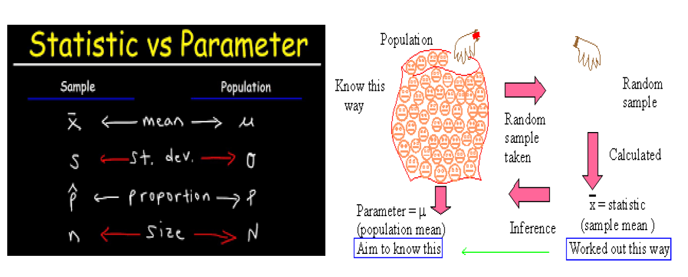
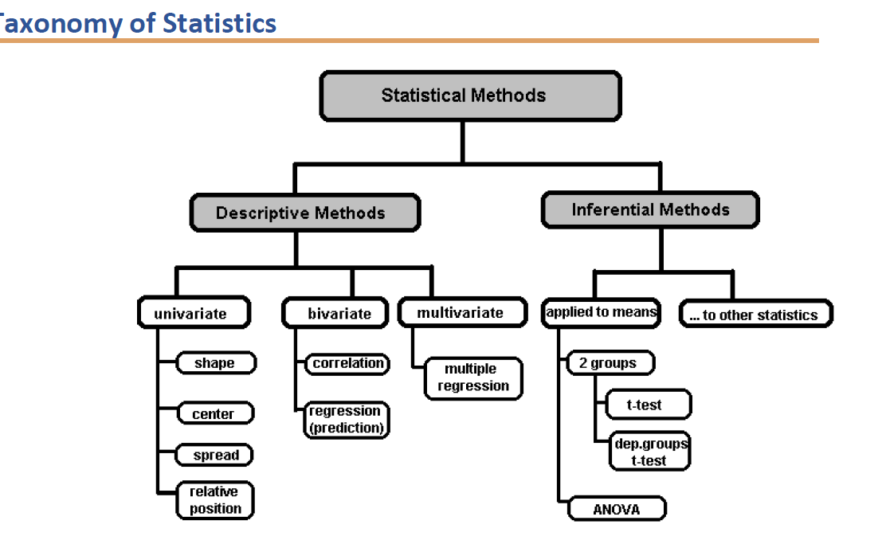
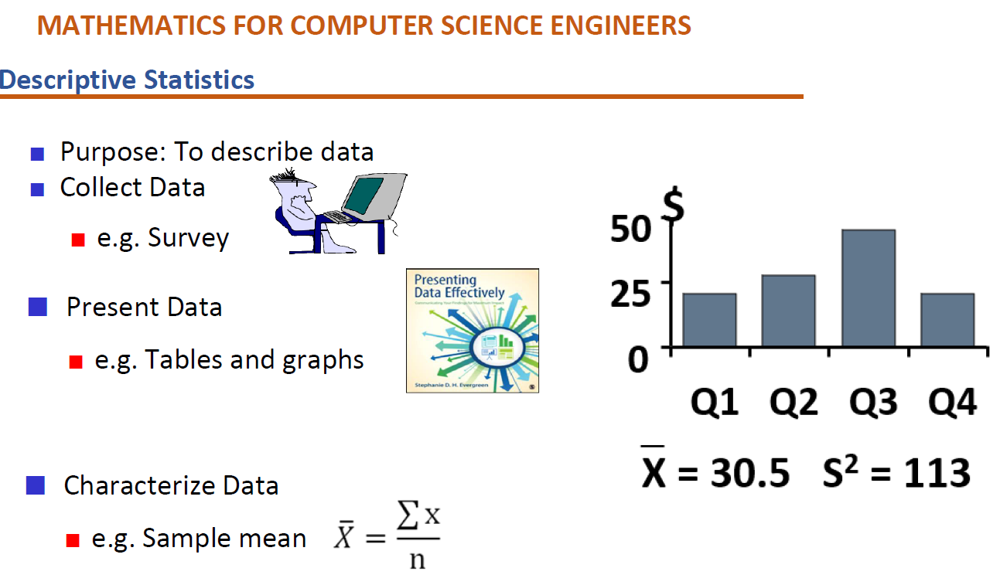
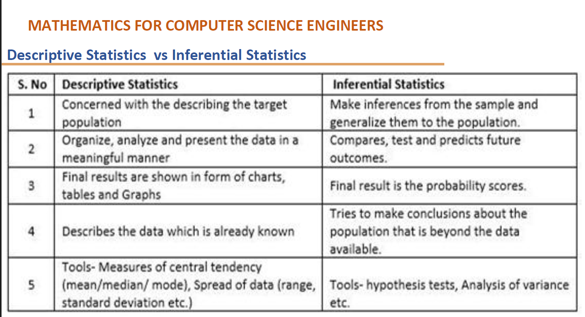
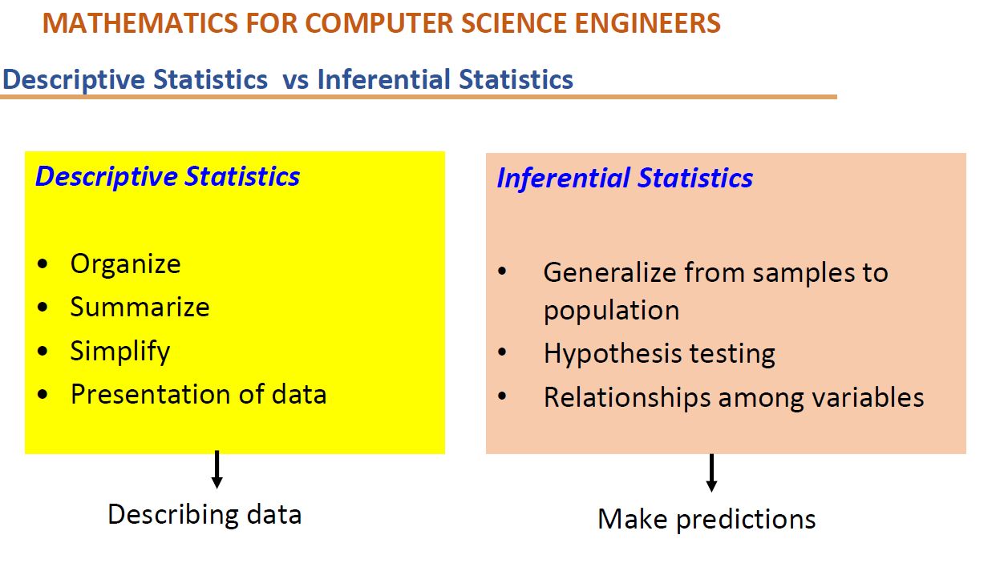

# Intro
	- What is statistics? #card
		- Statistics is a science of data. It involves collecting classifying summarising organising analysing and interpreting numerical information.
		- It involves study and manipulation of data including waste gather review analyse and draw conclusions from data.
	- Differentiate between sample statistic and population parameter? #card
		- Sample statistic is a numerical measurement describing some characteristic of sample. Examples are sample average sample median sample standard deviation in percentiles.
		- Population parameter is a numerical measurement describing some characteristic of a population. Examples are mean and variance of a population.
	- Describe the various notations used for sample and statistic parameters? #card
		- 
- # Taxonomy
	- Describe the taxonomy of statistics? #card
		- the statistical methods can be divided into descriptive methods and inferential methods. The descriptive methods provide description of the data whereas inferential methods are used to draw conclusions and Inferences based on the descriptive statistics used earlier.
		- The descriptive methods are divided into univariate bivariate and multivariate statistical methods.
		- The inferential methods are based on inferences that are applied to means and and inferences that are applied to other statistics.
	- What is univariate statistical method? #card
		- The univariate means the study involves one random variable. Example could be the height of people in certain region or or rainfall in certain region throughout the year.
		- Generally from the univariate methodologies we can analyse the shape of the overall data by plotting it in graphs. The central tendencies such as mean median invariance can be analysed. The spread of the data can be analysed using standard deviation. The relative position of a measurement with respect to other parameters can be measured.
	- What is bivariate statistical method? #card
		- the bivariate statistical methods typically invol ve two variables. Examples: Study of housing prices with respect to the area of the house. This involves two variables the price of the House and the area of the house.
		- In bivariate statistical methods we can do correlation analysis and regression Our prediction. The correlation analysis tries to understand how the two variables are correlated. Example:: the price of a house may increase linearly with increase in the area of the house. Or the price with respect to area in plotted could represent some kind of a polynomial function. This correlation analysis is typically done using some visualisations to start with such as scatter plots.
		- The regression analysis tries to use the correlation between the two variables and tries to predict the values one variable given another variable. For example we could predict the price of a house if given the area of the house.
	- What is multivariate statistical analysis question? #card
		- The multivariate statistical analysis is similar to the bivariate analysis except that instead of the two random variables there could be a set of random variables which means that there could be two or more random variables in the analysis. Example of this is the prices of the House with respect to the area of the house the location of the house the availability of transportation services etc.
		- As in mulled bivariate statistical analysis we can do correlation and regression. In the corrosion analysis different parameters are measured taken to at a time to understand the correlation.
	- Describe the inferential methods? #card
		- 
		-
- # Descriptive stats
	- What is descriptive statistics and how is it done? #card
		- Descriptor statistics and methods for organising and summarising data. It uses numerical and graphical methods to look for patterns in data sets to summarise information revealed in the data set and to present that information in a convenient form.
		- A descriptive value for a population is called a parameter the descriptive value for sample is called a statistic. For example tables or graphs are used organized data in descriptive value such as average score or used to summarize data
		- 
	- What are the different ways to organise data in descriptor statistics? #card
		- tables including frequency distribution and relative frequency distributions
		- graphs including bar chart or histogram. The stem or leaf plot and frequency polygon
	- What are the different methods summarizing data in descriptive statistics? #card
		- Central tendencies or groups' Middle values. This includes mean median and mode
		- Variation or summary of differences within groups. This includes range, interquartile range, variance and standard deviation
- # Inferential Statistics
	- What is inferential statistics? #card
		- International statistics utilises sample data to make estimates, decisions, predictions or other generalizations about a larger set of data.
		- There are two main areas of inferential statistics.
			- estimating parameters: this means taking a statistic in the sample data and using it to say something about the population parameter.
			- Hypothesis test:: this is where sample data can be used to answer research questions. Examples are: knowing if a new drug cancer is effective or or study to cheque if breakfast helps children perform better in schools.
	- Provide a tabular summary of descriptive and inferential statistical methods? #card
		- 
		- 
		-