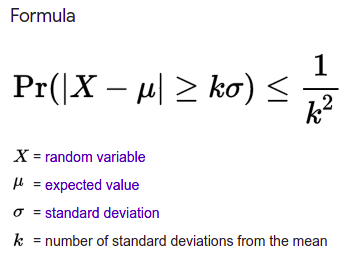
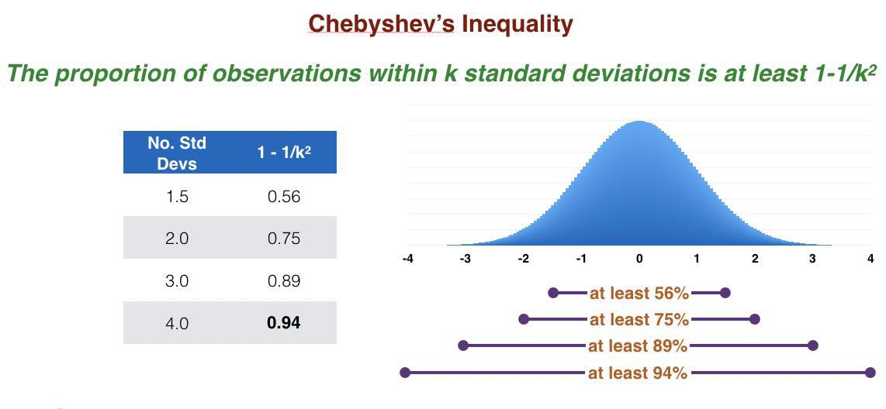
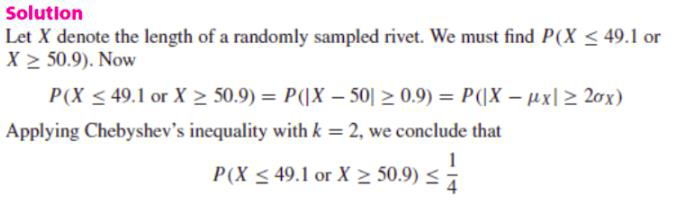
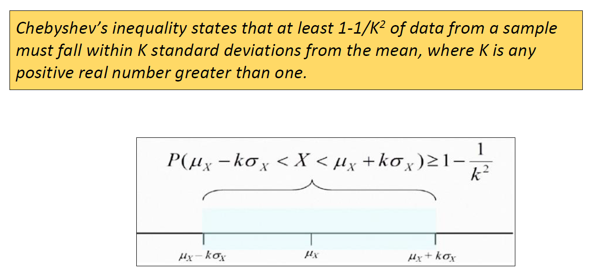
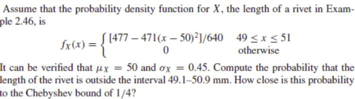
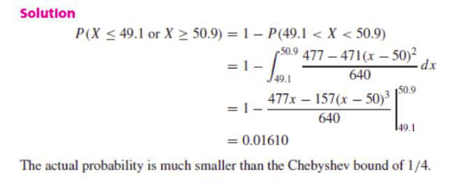
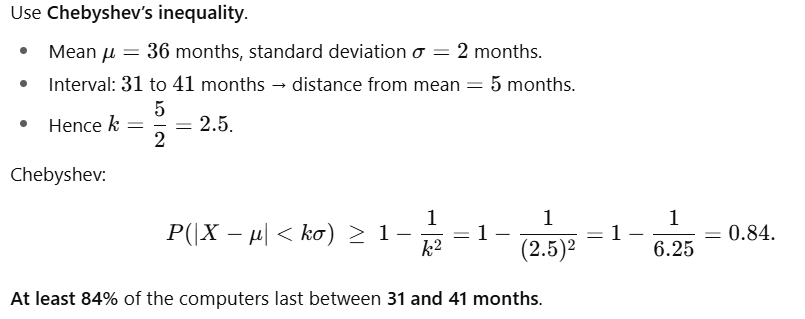
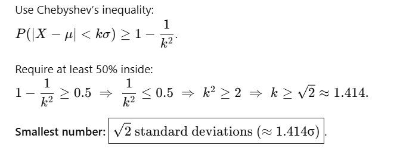

# Inequality
	- What are the concepts that chevyshev's inequality relate? #card
		- Chebyshev's inequality relates the mean and the standard deviation by providing a bound on the probability that a random variable takes on a value that differs from its mean by more than a given multiple of its standard deviation.
	- What is chebyshev's inequality? #card
		- Specifically, the probability that a random variable differs from its mean by k standard deviations or more is never greater than 1/k2.
		- Statement of Chebyshev's Inequality
		- Chebyshev's inequality states that at least 1 – 1/K² of data from a sample must fall within K standard deviations from the mean, where K is any positive real number greater than one.
		- Chebyshev's Inequality is used to describe the percentage of values in a distribution within an interval centered at the mean.
		- 
		- Only the case k > 1 is useful. When k ≤ 1 the right hand 1/ k2≥ 1 and the inequality is trivial as all probabilities are ≤ 1.
	- Pictorially and using tabular data describe the chebyshev's inequality #card
		- 
- # problems
	- solve :Problem 1: The length of a rivet manufactured by a certain process has mean μX = 50 mm and standard deviation σX = 0.45 mm. What is the largest possible value for the probability that the length of the rivet is outside the interval 49.1 – 50.9 mm? #card
		- 
		- 
	- Problem2
	  
	  #card
		- 
		-
	- Problem 3: When should chebyshev inequality used? #card
		- Because the Chebyshev bound is generally much larger than the actual probability, it should only be used when the distribution of the random variable is unknown.
		- When the distribution is known, then the probability density function or probability mass function should be used to compute probabilities.
		- To illustrate the inequality, we will look at it for a few values of K:
		  For K = 2 we have 1 - 1/K² = 1 - 1/4 = 3/4 = 75%. Chebyshev's inequality says that at least 75% of the data values of any distribution must be within two standard deviations of the mean.
		  For K = 3 we have 1 – 1/K² = 1 - 1/9 = 8/9 = 89%. So Chebyshev's inequality says that at least 89% of the data values of any distribution must be within three standard deviations of the mean.
	- Problem 4: Computers from a particular company are found to last on average for three years without any hardware malfunction, with standard deviation of two months. At least what percent of the computers last between 31 months and 41 months? #card
		- 
	- problem5: What is the smallest number of standard deviations from the mean that we must go if we want to ensure that we have at least 50% of the data of a distribution? #card
		- 
	- problem 6: The length of a metal pin manufactured by a certain process has mean 50 mm and standard deviation 0.45 mm. What is the largest possible value for the probability that the length of the metal pin is outside the interval [49.1, 50.9] mm? #card
		- Do it yourself :-)
	-
	- MCQ 1 According to Chebyshev’s inequality, the proportion of data within k standard deviations of the mean is at least:
	  A) 1/k
	  B) 1−1/k^2
	  C) 1−k
	  D) 1+1/k^2
	  #card
		- B
		-
	- MCQ 2. Using Chebyshev’s inequality, what proportion of data lies within 3 standard deviations of the mean?
	  A) At least 66.7%B) At least 75%C) At least 88.9%D) At least 95% #card
		- C
		-