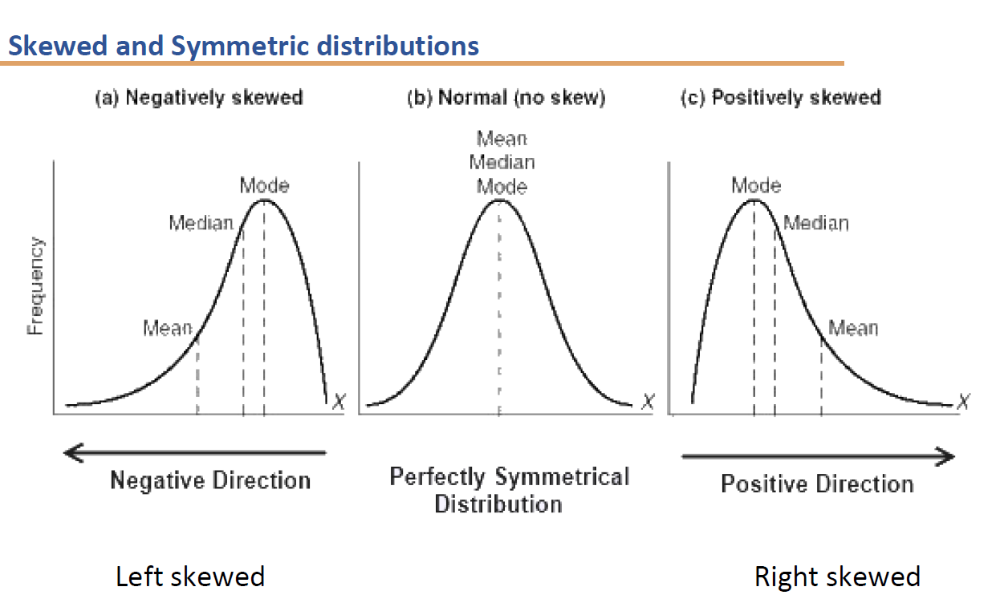
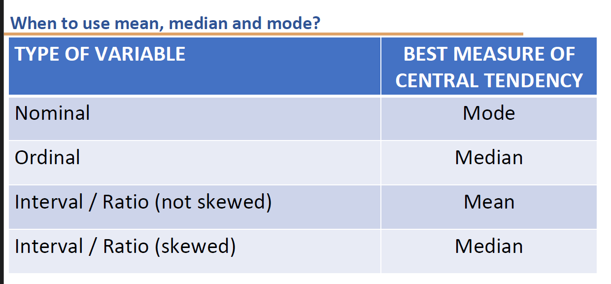

- What is skewness? #card
	- Skewness is a measure of the asymmetry of the distribution of about its mean.
	- The skewness value can be positive, zero, negative, or undefined.
- What is symmetric distribution? #card
	- A symmetric distribution when neither the left and right hand sides of the distribution are roughly equally balanced around the mean.
	- Insymmetric distributions: The mean, median, and mode are the same.
- What is skewed distribution? #card
	- Skewed Distribution: A skew distribution where the left and right sides of the distribution are not balanced around the mean.
	- In skewed data, the mean and median lie further toward the skewness than the mode.
	- The greater the distance of mean and median, the greater is the skewness of the distribution.
- Represent the Left skewed, symmetrical and right skewed distributions along with mean, median and mode #card
	- 
-
- Describe how to determine the skewness using the central tendency measures? #card
	-
	- Distribution of a variable: tells us what values the variable takes and how often it takes these values.
	- Shape: It is the "shape" of the distribution of the data.
	- If mean = median = mode, the shape of the distribution is symmetric.
	- If mode < median < mean, the shape of the distribution trails to the right, is positively skewed.
	- If mean < median < mode, the shape of the distribution trails to the left, is negatively skewed.
	- Distributions of various "shapes" have different properties and names such as the "normal" distribution, which is also known as the "bell curve" (among mathematicians it's called the Gauss distribution).
- Explain the different scenarios in which mean, median and mode are useful?
	- 
	-